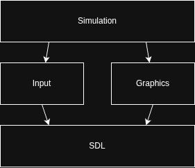

# Fixed-Wing Flight Simulator
This is an implementation of a flight simulator using the JSBSim framework and C++. 

**Roadmap text, this is what the branch is working towards:**

Without graphics, the sim works anywhere that supports SDL2. The current visualizer is only supported on Ubuntu 24.04. If you're on a different OS/Distro, you'll need to supply your own. dataspec.json shows the structure that the visualizer received (outputs).

The diagram below shows the dependency flow of the program. The simulation is designed to run on its own, depending on modules for added functionality.



---

## Running the sim

Start off by cloning the [JSBSim git repo](https://github.com/JSBSim-Team/jsbsim.git) somewhere.

### Compile from source
This is designed for and tested on Ubuntu 24.04.

You're gonna need to install the required libraries:
```shell
sudo apt install cmake build-essential pkg-config libsdl2-2.0-0 libsdl2-dev libglm-dev
```
```shell
sudo apt-get install -y ./libraries/JSBSim_*.deb ./libraries/JSBSim-devel_*.deb
````

Make sure you have your environment variables set
```dotenv
JSBSIMDIR="/your/jsb/dir"
```

Then run it with:
```shell
rm -rf build
cmake -B build
cmake --build build
./build/JSB
```
You can generally omit the first two commands after you've built your directories.

### Docker Compose

---

### Todo:
| Feature                   | Status       | Notes                                                                                                                             |
|---------------------------|--------------|-----------------------------------------------------------------------------------------------------------------------------------|
| Enable own visualiers     | In progress  | Graphics are currently built in via OpenGL and will (likely) only run on Linux. Enable streaming to a separate graphics interface | 
| Dockerize                 | Needs update | Make it run anywhere! (that runs Docker)                                                                                          |
| Multiple aircraft at once | TBD          | Allow the user to perform mid-air collisions                                                                                      |
| Custom environments       | TBD          | Set up your own worlds and environments be creating bespoke XML Reset files                                                       |
| Unit tests                | Need more    | Oh no                                                                                                                             |
| Add CI/CD pipeline to git | TBD          | Verify that all works before allowing merge                                                                                       |

--- 

#### Generative AI use declaration
I try to stay away from generative AI as a means of generating code/debugging. However, it is sometimes indispensable 
if Googling fails. To this extent, I use generative AI to help me solve issues I can't figure out on my own. If a code 
snippet does appear in my codebase, I make sure I fully understand what's happening. The design and structure of the 
project is fully mine.
